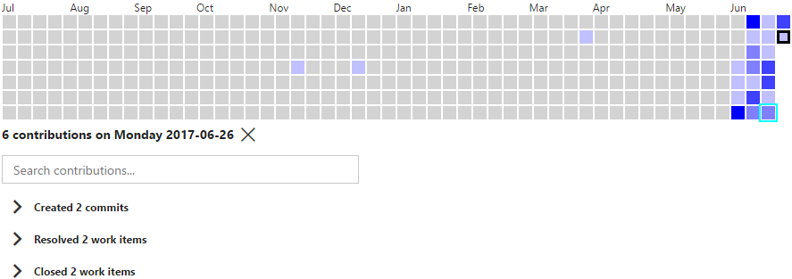
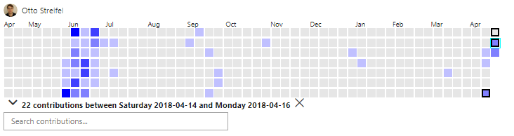

  

# Contributions Details

Drill down into the specific contributions  

  

Click the selected day to show contributions for the whole year.

Click that any day on the graph to show only the contribution details for that particular day

## Time Range

Once one day is selected hold shift while selecting another day with the keyboard or mouse. This will expand the select time range to include that day.

  
  

# Version History
(10/30/2017) v1.6.38 Move from dash boards hub to work hub  
(09/19/2017) v1.6.26 Squash bug filtering tfvc changeset contributions  
(07/10/2017) v1.6.7 Restore identity picker  
(06/29/2017) v1.6.1
- Disable widget
- Make identity picker readonly

(06/26/2017) v1.5.70
- keyboard navigation of graph
- fix bug selecting day to include in time range
- fix casing issue in search
  
(06/25/2017) v1.5.52 
- Specify time range with shift click
- arrow through results
- search title text  

(06/24/2017) v1.5.1 Usuability Updates
- UI performance (lists and day selection)
- coloring of days is now by value not percentile
- Button to clear the current date selection

(06/22/2017) v1.4.1 Performance Updates  
- Add repository filter for git commits and pullrequests  
- Add repository default of repo matching current project name or first repo  

(06/18/2017) v1.3.18 Validate for TFS 2015u4 Onwards  
(06/17/2017) v1.3.8 Validate for TFS 2017 Onwards  
(06/16/2017) v1.3.1 Include tvcs changeset contribution types    
(06/16/2017) v1.2.1 Dashboard Widget
(06/14/2017) v1.1.1 Select identity for contributions  
(06/11/2017) v1.0.9 Fix issue retrieving commits  
(06/11/2017) v1.0.1 Initial Release
