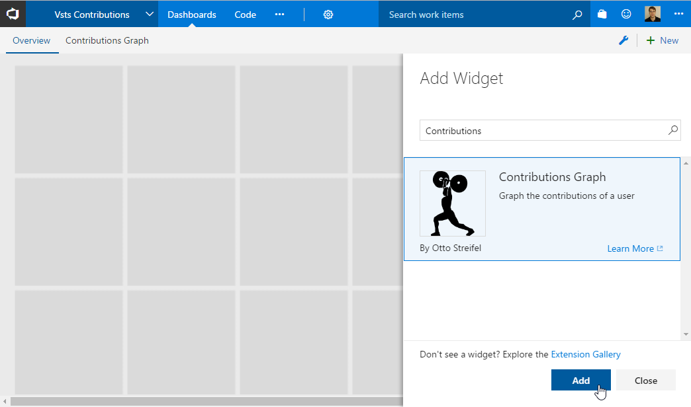
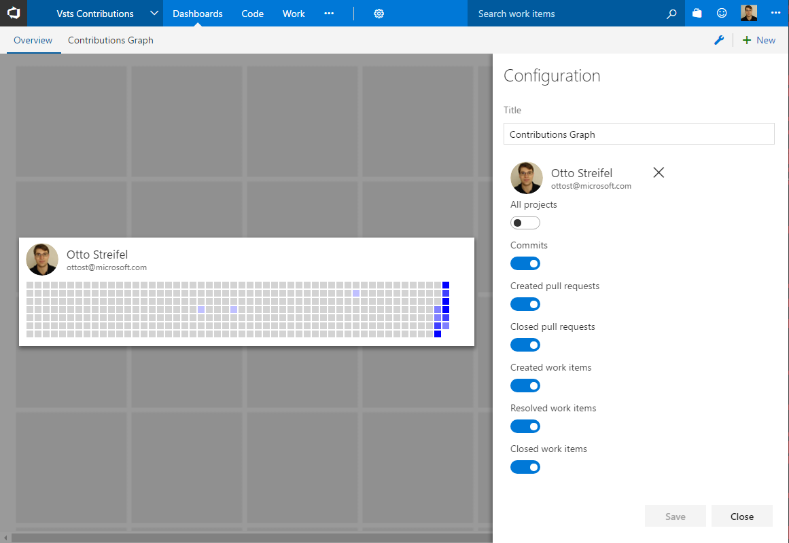
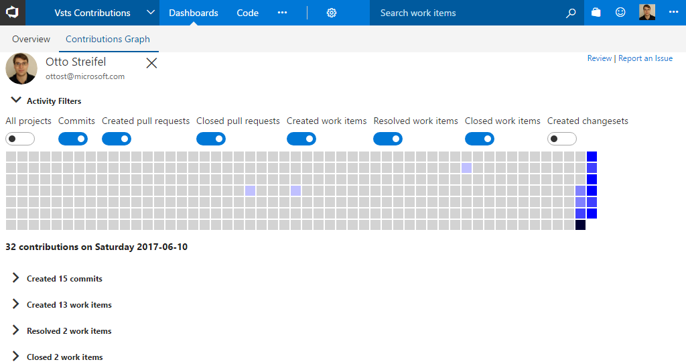
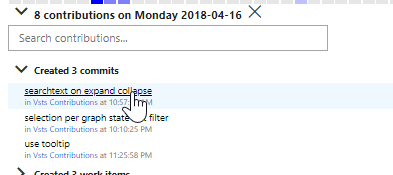

# Contributions Widget
Add the contributions widget

Configure which contribution types to show

Click a day to bring up the details for that day in a new tab

# Contributions Details

Drill down into the specific contributions  

  

Click the selected day to show contributions for the whole year.

Click that any day on the graph to show only the contribution details for that particular day

## Version History
(06/25/2017) v1.5.52 Specify time range with shift click, arrow through results, search title text  
(06/24/2017) v1.5.1 Usuability Updates
- UI performance (lists and day selection)
- coloring of days is now by value not percentile
- Button to clear the current date selection

(06/22/2017) v1.4.1 Performance Updates  
- Add repository filter for git commits and pullrequests  
- Add repository default of repo matching current project name or first repo  

(06/18/2017) v1.3.18 Validate for TFS 2015u4 Onwards  
(06/17/2017) v1.3.8 Validate for TFS 2017 Onwards  
(06/16/2017) v1.3.1 Include tvcs changeset contribution types    
(06/16/2017) v1.2.1 Dashboard Widget
(06/14/2017) v1.1.1 Select identity for contributions  
(06/11/2017) v1.0.9 Fix issue retrieving commits  
(06/11/2017) v1.0.1 Initial Release
