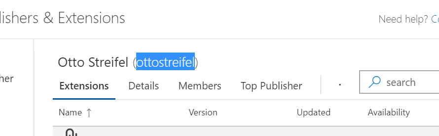
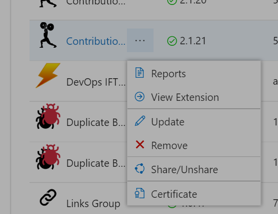
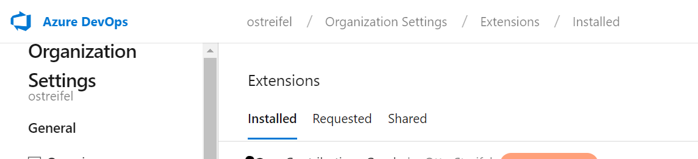

### Structure ###

```
/scripts            - Typescript code for extension
/img                - Image assets for extension and description
/typings            - Typescript typings

details.md          - Description to be shown in marketplace
index.html          - Main entry point
vss-extension.json  - Extension manifest
```

### Version History ###

```
0.7.0 - Updated VSS SDK, moved from `typings` to `@types`
0.6.0 - Updated VSS SDK to M104
0.1.1 - Automatically increase extension's minor version when packaging.
```

### Getting Started ###
1. Clone the repository
2. `npm i -g gulp typescript tslint tfx-cli` to setup required globals
3. `npm install` to install required local dependencies and get an initial build
4. `npm run package-dev` to to rebuild once code changes are made
5. Upload the -dev vsix to https://marketplace.visualstudio.com/manage
   - this will require the `publisher` field in `vss-extension.json` to be set to your publisher name
    
   - Share the dev version of the extension with a test account
    
   - Go to the extensions page of the test account, look for the shared extension and install it.
    
7. Submit changes as pull request to master

#### Including framework modules ####

The VSTS framework is setup to initalize the requirejs AMD loader, so just use `import Foo = require("foo")` to include framework modules.

#### VS Code ####

The included `.vscode` config allows you to open and build the project using [VS Code](https://code.visualstudio.com/).

